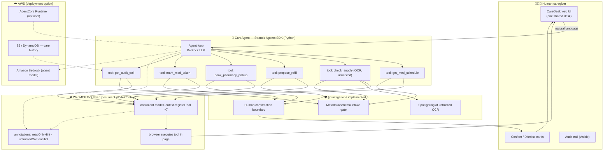

# CareDesk Architecture — for Agents for Humans (AWS Strands)

## Two integration faces, one product

- **WebMCP face** (browser-native): the site registers 7 tools; any WebMCP host
  (ChatGPT in-app browser, Chrome agent) calls them. Human confirms on the page.
- **Strands face** (this hackathon): the same tool surface wrapped as
  Strands Agents SDK tools (Python). The Strands agent runs the loop with
  Amazon Bedrock; the WebMCP layer stays the actuation surface inside the site.
  The caregiver experiences ONE desk; the agent runtime is swappable.

## Security posture (spec §6)

1. Spotlighted untrusted spans (OCR) — §6.4.3.
2. Metadata/schema intake gate — §6.3.1.1 + §6.3.3.
3. Human confirmation boundary — §6.3.2.3. Consequential tools **queue**; only
   the human card confirms; every step audited.